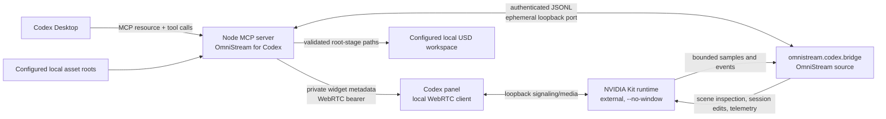

# Architecture

## Ownership boundaries

- **Codex panel** — OmniStream source; displays actual decoded Kit frames and relays native viewport input.
- **MCP server** — OmniStream source; owns only the Kit process it starts, validates stage paths, serializes mutations, redacts credentials, and gates safe stop.
- **`omnistream.codex.bridge`** — OmniStream source; installed into the user's external Kit checkout. It connects outbound to an authenticated ephemeral loopback server and performs stage/timeline/camera commands inside Kit.
- **NVIDIA Kit runtime and WebRTC SDK** — external dependencies retrieved on the user's machine from NVIDIA. They are not present in OmniStream release archives.
- **Workspace/assets** — user-selected local files; their paths live in local config, not the plugin manifest/source.

## Simulation orchestration model

OmniStream separates a **validated simulation configuration** from a **tracked runtime run**. `configure_omniverse_simulation` stores the bounded workspace/stage and session playback policy without touching Kit. `launch_omniverse_simulation` snapshots that configuration and executes runtime start/readiness, stage open, and session configuration as one serialized side-effect operation. Only after every launch step completes is a `runId` published.

`supervise_omniverse_simulation` is the canonical aggregated read model consumed by Codex and the panel. `control_omniverse_simulation` is the canonical bounded write model for playback. Lower-level lifecycle/stage/timeline tools remain available for diagnostics and compatibility, but normal workflows do not need to manually compose them.

This separation prevents UI configuration edits from silently changing a running simulation and prevents another mutation from interleaving during a launch sequence. A timeout with an uncertain effect is recorded on the managed session and closes the normal mutation path until reconciled.

## Current-stage editing and observation

The scene tools operate on the stage already open in the managed Kit session. They do not reload the configured file. A proposed edit is validated on an isolated USD stage, then applied to an OmniStream-owned session override layer only when its `stageId`, expected revision and unexpired preview still match. Undo/discard affects those managed edits; export writes a new `.usda` override layer under the configured workspace. The source stage is not saved by these patch operations. Explicit camera saving remains a separate source-writing action.

Kit samples selected USD values and sends bounded events through the authenticated bridge. The MCP server caches the latest sample and event cursor; Codex reads that cache through `read_omniverse_live_telemetry`. The panel polls while visible. This path reports USD-visible values and event freshness; it is not a hard real-time model loop or a measurement of GPU frame rate. See [Scène ouverte](LIVE-SCENE.md) for supported edits and limits.

## Stream configuration

The MCP runtime chooses the signaling/media ports once and passes the same values to Kit at launch using `omni.kit.livestream.app` primary stream settings. Runtime status returns those values to the React panel, which uses them to connect. This removes the previous split-brain risk where Kit and the client could silently use different ports.

## Persistence contract

Timeline operations and camera navigation are session operations. OmniStream does not create cameras. Temporary camera movement is authored in the USD session layer and tracked as dirty. Selecting another camera is refused while that temporary pose is unsaved. In the camera workflow, `save_omniverse_camera` is the explicit persistence operation: after confirmation, it writes the selected camera pose to a writable source layer and removes OmniStream's temporary session override. Scene corrections use the separate new-file-only override export described above.

## Network and credential contract

The control bridge uses `127.0.0.1`, an ephemeral port, and a random per-session token supplied through the child process environment. The WebRTC bearer is sent to the panel only through private widget metadata. Secrets are not placed in public tool results, process arguments, normalized config, or user-facing logs.
